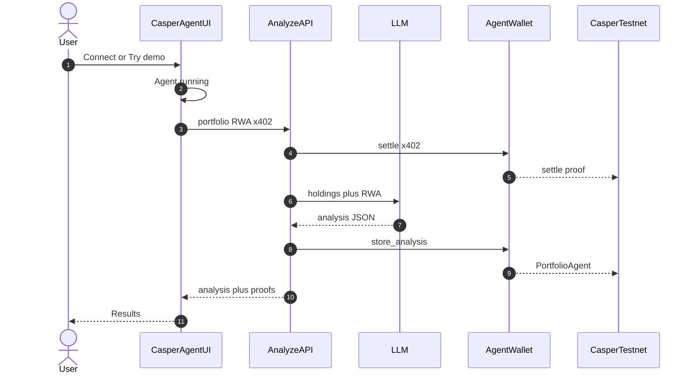
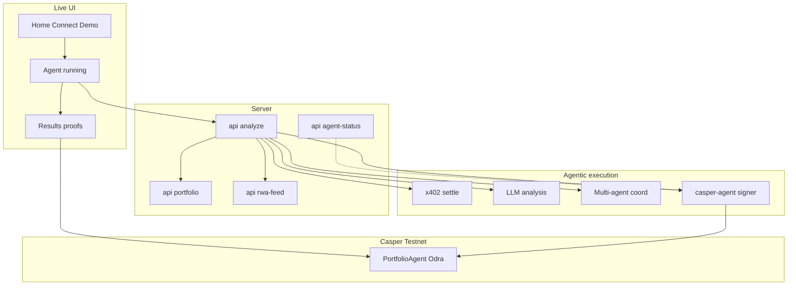

<div align="center">


# CasperAgent

**Finalist · Casper Agentic Buildathon 2026 — Final Round**

Autonomous portfolio agent on **Casper Testnet**.  
Connect a wallet → agent settles **x402** → analyzes holdings with AI → writes **`store_analysis`** on-chain → returns clickable explorer proof.

[](https://casper-ai-portfolio-agent.vercel.app)
[](https://testnet.cspr.live)
[](https://www.casper.network/ai)
[](./odra-project)
[](./LICENSE)

**[Live App](https://casper-ai-portfolio-agent.vercel.app)** ·
**[Judge Playbook](./JUDGE_PLAYBOOK.md)** ·
**[Contract](https://testnet.cspr.live/contract/0b4e53d2415953680a79a89069d91e673329c0a15a1897513a99f69124eb04b6)** ·
**[Sample tx](https://testnet.cspr.live/transaction/cc648f7dab74736d2c0bb12b0178648f87b42c2b3cdd97c7de9a5b2a1307b779)** ·
**[X](https://x.com/CasperAgentAI)** ·
**[Telegram](https://t.me/casperagent)**

</div>

---

## What it is

**CasperAgent** is a production-shaped agentic DeFi app for the Final Round:

| Layer | What judges see |
|---|---|
| Live product | Minimal home → full-screen **Agent running** → results with proofs |
| Agentic AI | GPT-4o / Claude / heuristic analysis; agent wallet signs without the user |
| x402 | Real settle path (facilitator **or** agent-wallet native CSPR) with explorer URL |
| On-chain | Odra `PortfolioAgent.store_analysis` on Casper Testnet |
| RWA | Live Treasury.gov + CoinGecko context in analysis |
| Brand | Lime mark + **Built On Casper Network** attribution |

Same story on the [live site](https://casper-ai-portfolio-agent.vercel.app), this README, and `main`.

---

## Judge verify (60 seconds)

1. Open https://casper-ai-portfolio-agent.vercel.app  
2. Tap **Try demo** (or paste a Casper public key → **Connect & Analyze**)  
3. Wait on **Agent running** / “Working on your portfolio”  
4. On results, confirm:
   - Portfolio value + holdings  
   - **x402** / **On-chain** proof chips (click → `testnet.cspr.live`)  
   - Insight + next steps  
   - **Built On Casper Network**  
5. Optional diagnostics (no secrets): `/api/agent-status`  
6. Essentials on home: **Docs** · **Contract** · **Verify**

---

## Live product surface

Matches the deployed UI (not the older marketing layout):

| Screen | Content |
|---|---|
| **Home** | CasperAgent mark + wordmark · Connect & Analyze · Try demo · Essentials (Docs / Contract / Verify) · Built On Casper |
| **Running** | Full-viewport agent state while analysis + settle + on-chain write run |
| **Results** | Value · risk · x402 / on-chain / reputation chips · holdings · insight · next steps · explorer proofs · Built On Casper |

---

## Agentic loop

Always-visible steps (works even if diagrams fail to render):

1. User taps **Connect & Analyze** or **Try demo**
2. UI shows **Agent running**
3. `/api/analyze` loads portfolio + RWA + x402 header
4. Agent wallet settles **x402** (when configured) → Testnet proof
5. LLM analyzes holdings + RWA context
6. Agent wallet calls Odra **`store_analysis`**
7. UI shows **Results** with explorer links



---

## On-chain proof

| Artifact | Value |
|---|---|
| Package hash | `2f76596281bab4993440f5bd88728a34faa1031ab4b7ce8e0064219e1ae2e03d` |
| Contract | [`0b4e53d2…04b6`](https://testnet.cspr.live/contract/0b4e53d2415953680a79a89069d91e673329c0a15a1897513a99f69124eb04b6) |
| Sample `store_analysis` | [`cc648f7d…7b779`](https://testnet.cspr.live/transaction/cc648f7dab74736d2c0bb12b0178648f87b42c2b3cdd97c7de9a5b2a1307b779) — **Success** |
| Contract install | [`9460c0d3…dc0a`](https://testnet.cspr.live/transaction/9460c0d39fe20ee75efcf768e6b7bb2f3a5597aff956e5eea141312b22a2dc0a) |

Paste this table onto the DoraHacks Final Round BUIDL page.

---

## Final Round criteria map

Aligned to **Casper Agentic Buildathon 2026 — Final Round** jury criteria:

| Criterion | How CasperAgent maps |
|---|---|
| **Technical Execution** | Next.js 14 app, Odra/Rust contract, Jest + Playwright, CI (lint/build, E2E, Odra WASM), CodeQL, Dependabot |
| **Innovation & Originality** | Closed agentic loop on Casper: pay → analyze → persist hash on-chain with reputation |
| **Use of AI / Agentic Systems** | LLM analysis + autonomous agent wallet signing; multi-agent coordination in `/api/analyze` |
| **Real-World Applicability** | Portfolio risk + live RWA feeds (T-bills / gold / ONDO-style context) for DeFi advice |
| **User Experience & Design** | Minimal product UI: home → running → results; lime brand; dark mode; demo path |
| **Working Smart Contracts** | Deployed `PortfolioAgent` on Testnet with verified `store_analysis` txs |
| **Long-Term Launch Plans** | Roadmap below · socials · mainnet / facilitator / CEP-18 plans |
| **Potential for Long-Term Impact** | Open-source Casper agentic DeFi + x402 settle reference for builders |

### Buildathon fit (AI Toolkit)

Uses Casper’s agent stack directions from [casper.network/ai](https://www.casper.network/ai):

- **x402** micropayment settle with explorer proof  
- **CSPR.cloud** portfolio reads  
- **Odra** contract with AI-friendly repo layout  
- **MCP** enrichment when servers are configured  
- Agent wallet signing via Casper 2.0 JS SDK  

---

## Stack

| Layer | Tech |
|---|---|
| App | Next.js 14 · React 18 · Tailwind · Zustand · Framer Motion |
| AI | GPT-4o → Claude 3.5 → heuristic fallback |
| Chain | `casper-js-sdk` v5 · Casper 2.0 Testnet |
| Contract | Odra / Rust · `odra-project/` |
| Data | CSPR.cloud · Treasury.gov · CoinGecko · MCP (optional) |
| Payments | x402 facilitator **or** agent-wallet native settle |
| Deploy | Vercel ← `main` |

---

## Quick start

```bash
git clone https://github.com/thesithunyein/casper-ai-portfolio-agent.git
cd casper-ai-portfolio-agent
npm install
cp .env.example .env.local
npm run dev
```

| Variable | Need | Purpose |
|---|---|---|
| `NEXT_PUBLIC_CSPR_CLOUD_API_KEY` | Yes | Live balances |
| `OPENAI_API_KEY` | Recommended | GPT analysis |
| `CASPER_AGENT_PRIVATE_KEY_PEM` | On-chain | Sign txs + x402 settle |
| `PORTFOLIO_AGENT_PACKAGE_HASH` | On-chain | `2f765962…e03d` |
| `X402_FACILITATOR_URL` | Optional | HTTP facilitator |
| `ENABLE_AUTONOMOUS_REBALANCE` | Optional | `1` = rebalance transfers |

---

## Architecture (repo to live)

```text
Home (Connect / Demo)
   → Agent running
      → /api/analyze
         → portfolio + rwa-feed
         → x402 settle
         → LLM analysis
         → multi-agent coord
         → casper-agent signer
            → Casper Testnet PortfolioAgent (store_analysis)
   → Results (proofs + Built On Casper)
```



---

## Roadmap

| When | Milestone | Status |
|---|---|---|
| Q2 2026 | MVP on Casper Testnet | Shipped |
| Jul 2026 | Final Round product UI + x402 settle + proof pack | Shipped |
| Q3 2026 | Hardened HTTP facilitator + richer RWA writes | In progress |
| Q3 2026 | Mainnet PortfolioAgent (audit) | Planned |
| Q4 2026 | CEP-18 multi-token + deeper MCP yield | Planned |
| Q1 2027 | Mobile PWA + Wallet/Ledger | Planned |

---

## Repo layout

```
src/app          # Routes + API (matches Vercel)
src/components   # Home · running · results · brand
src/lib          # casper-agent, x402, multi-agent, reputation
odra-project/    # PortfolioAgent (Rust / Odra)
e2e/             # Playwright
JUDGE_PLAYBOOK.md
```

---

## Security & quality

- CodeQL · Dependabot · CI (lint/build, Playwright, Odra WASM)  
- CSP, HSTS, input caps, fetch timeouts  
- [CODE_OF_CONDUCT.md](./CODE_OF_CONDUCT.md) · [CONTRIBUTING.md](./CONTRIBUTING.md)  
- Keep `main` always deployable (Final Round rule)

---

## Team

**Sithu Nyein** — solo  
GitHub [@thesithunyein](https://github.com/thesithunyein)

MIT — [LICENSE](./LICENSE)
