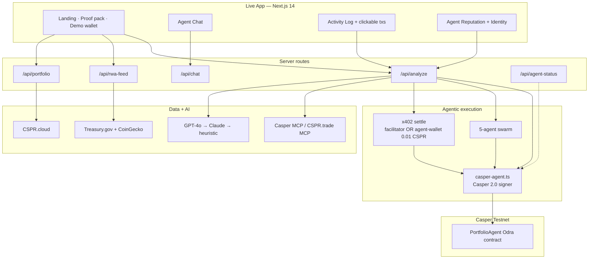
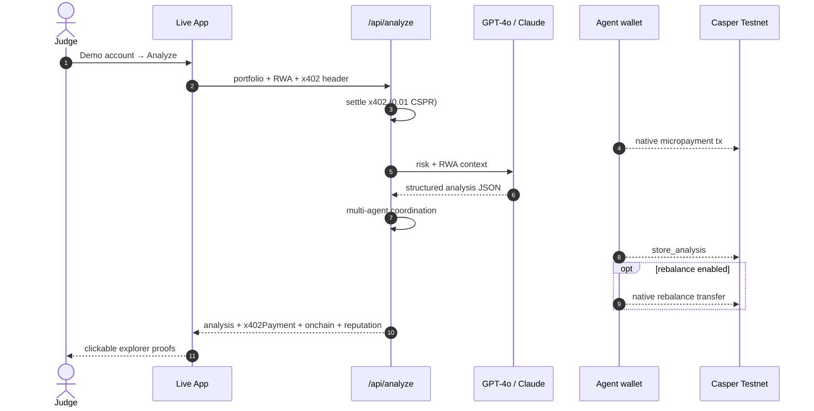
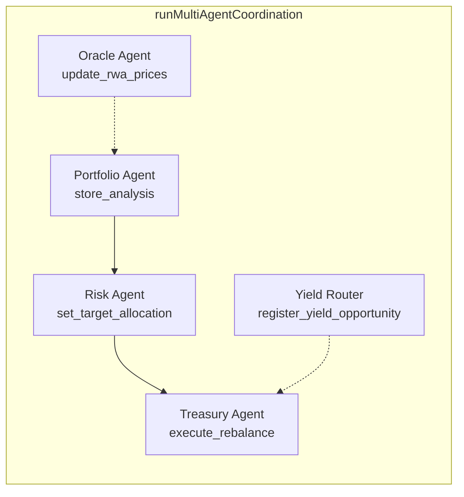
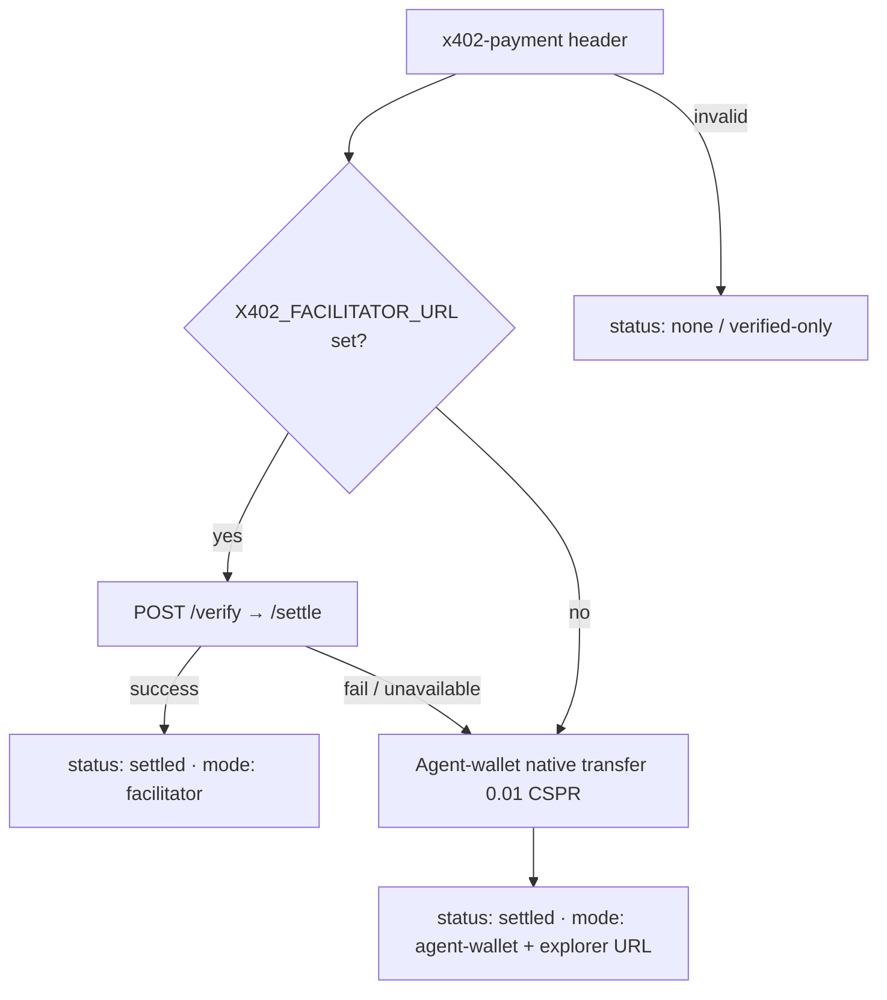

<div align="center">


# Casper AI Portfolio Agent

**Finalist · Casper Agentic Buildathon 2026 — Final Round**

Autonomous portfolio agent on **Casper Testnet**:  
reads holdings → settles **x402** → analyzes with GPT-4o → **signs real Casper 2.0 txs** → scores agent reputation → optional rebalance.

[](https://casper-ai-portfolio-agent.vercel.app)
[](https://testnet.cspr.live)
[](https://www.casper.network/ai)
[](./odra-project)
[](./LICENSE)

**[Live App](https://casper-ai-portfolio-agent.vercel.app)** ·
**[Judge Playbook](./JUDGE_PLAYBOOK.md)** ·
**[Contract](https://testnet.cspr.live/contract/0b4e53d2415953680a79a89069d91e673329c0a15a1897513a99f69124eb04b6)** ·
**[X](https://x.com/CasperAgentAI)** ·
**[Telegram](https://t.me/casperagent)**

</div>

---

## Judge verify (60 seconds)

> Live site, this README, and the GitHub `main` branch describe the **same** product.

1. Open https://casper-ai-portfolio-agent.vercel.app  
2. Use sticky **Judges** bar → **Try demo** (or scroll to Connect → **Try with Demo Account**)  
3. Click **Analyze Portfolio**  
4. Confirm activity log: portfolio → live RWA → **x402 settle** → AI → `store_analysis`  
5. Open tx links on `testnet.cspr.live` → status **Success**  
6. Check **Agent Identity**, **Agent Reputation**, Multi-Agent, Yield Routing, and **On-chain proof** section  

Diagnostics (no secrets): `/api/agent-status`

---

## System architecture



---

## Agentic sequence (what judges see)



---

## Multi-agent swarm



| Agent | On-chain entry point | Role |
|---|---|---|
| Portfolio | `store_analysis` | Persist analysis hash + risk |
| Risk | `set_target_allocation` | CSPR / stable / RWA / DeFi targets |
| Treasury | `execute_rebalance` | Record + optional native transfer |
| Oracle | `update_rwa_prices` | T-bill / PAXG / ONDO / CSPR |
| Yield Router | `register_yield_opportunity` | APY / TVL / risk registry |

---

## x402 settlement path



UI never claims “confirmed on Testnet” until a settle path returns a real result.

---

## On-chain proof (same as live **Proof** section)

| Artifact | Value |
|---|---|
| Package hash | `2f76596281bab4993440f5bd88728a34faa1031ab4b7ce8e0064219e1ae2e03d` |
| Contract | [`0b4e53d2…04b6`](https://testnet.cspr.live/contract/0b4e53d2415953680a79a89069d91e673329c0a15a1897513a99f69124eb04b6) |
| Sample `store_analysis` | [`cc648f7d…7b779`](https://testnet.cspr.live/transaction/cc648f7dab74736d2c0bb12b0178648f87b42c2b3cdd97c7de9a5b2a1307b779) — Success |
| Contract install | [`9460c0d3…dc0a`](https://testnet.cspr.live/transaction/9460c0d39fe20ee75efcf768e6b7bb2f3a5597aff956e5eea141312b22a2dc0a) |
| CI `store_analysis` | `bca8c90f0326424745efb591a748c5d2e93ca3ce0a42c6e2580c69781239136a` |

Paste this table onto the DoraHacks Final Round BUIDL page.

---

## Live product surface (what the site shows)

| Surface | Purpose |
|---|---|
| Finalist hero + terminal preview | Positioning |
| Capabilities · How it works · FAQ · RWA | Product story |
| **On-chain proof** | Package hash + sample txs |
| Demo wallet → Analyze | End-to-end agentic loop |
| Agent Identity | Live signer public key + settle mode |
| Agent Reputation | 0–100 grade from this run |
| x402 / On-chain / Autonomous cards | Clickable explorer links |
| Multi-Agent + Yield Routing | Swarm + routes (MCP or labeled reference) |
| Sticky Judges bar | Proof · Try demo · Status |

---

## Final Round criteria map

| Criterion | Evidence |
|---|---|
| Technical Execution | Next.js 14 + Odra/Rust, Jest, Playwright, CI, CodeQL, Dependabot, CSP/HSTS |
| Innovation | Closed loop on Casper + x402 settle + 5-agent swarm + reputation hash |
| AI / Agentic | GPT-4o / Claude / heuristic; agent signs without human approval |
| Real-World Applicability | Live T-bill / PAXG / ONDO in rebalancing advice |
| UX & Design | Demo mode, dark mode, WCAG AA, judge-first proof UX |
| Working Smart Contracts | Deployed `PortfolioAgent` (15 entry points) |
| Long-Term Launch Plans | Roadmap + socials + mainnet / facilitator / CEP-18 |
| Long-Term Impact | Open-source Casper agentic DeFi + x402 reference |

---

## Stack

| Layer | Tech |
|---|---|
| App | Next.js 14, React 18, Tailwind, Zustand |
| AI | GPT-4o → Claude 3.5 → heuristic |
| Chain | `casper-js-sdk` v5 · Casper 2.0 |
| Contract | Odra / Rust · `odra-project/` |
| Data | CSPR.cloud · Treasury.gov · CoinGecko · MCP |
| Payments | x402 facilitator **or** agent-wallet settle |
| Deploy | Vercel ← `main` |

---

## Quick start

```bash
git clone https://github.com/thesithunyein/casper-ai-portfolio-agent.git
cd casper-ai-portfolio-agent
npm install
cp .env.example .env.local
npm run dev
```

| Variable | Need | Purpose |
|---|---|---|
| `NEXT_PUBLIC_CSPR_CLOUD_API_KEY` | Yes | Live balances |
| `OPENAI_API_KEY` | Recommended | GPT analysis |
| `CASPER_AGENT_PRIVATE_KEY_PEM` | On-chain | Sign txs + x402 settle |
| `PORTFOLIO_AGENT_PACKAGE_HASH` | On-chain | `2f765962…e03d` |
| `X402_FACILITATOR_URL` | Optional | HTTP facilitator |
| `ENABLE_AUTONOMOUS_REBALANCE` | Optional | `1` = rebalance transfers |

---

## Roadmap

| When | Milestone | Status |
|---|---|---|
| Q2 2026 | MVP on Casper Testnet | Shipped |
| Jul 2026 | Final Round: x402 settle, proof pack, reputation, CodeQL | Shipped |
| Q3 2026 | Live HTTP facilitator + on-chain RWA oracle writes | In progress |
| Q3 2026 | Mainnet PortfolioAgent (audit) | Planned |
| Q4 2026 | CEP-18 multi-token + deeper MCP yield | Planned |
| Q1 2027 | Mobile PWA + Wallet/Ledger + agent mesh | Planned |

---

## Repo layout

```
src/app          # Live routes + API (matches Vercel)
src/components   # UI: proof, identity, reputation, agents, yield
src/lib          # casper-agent, x402, multi-agent, reputation, yield
odra-project/    # PortfolioAgent (Rust / Odra)
e2e/             # Playwright
JUDGE_PLAYBOOK.md
```

---

## Security & quality

- CodeQL · Dependabot · CI (lint/build, Playwright, Odra WASM)
- CSP, HSTS, input caps, fetch timeouts
- [CODE_OF_CONDUCT.md](./CODE_OF_CONDUCT.md) · [CONTRIBUTING.md](./CONTRIBUTING.md)
- Keep `main` always deployable (Final Round rule)

---

## Team

**Sithu Nyein** — solo  
GitHub [@thesithunyein](https://github.com/thesithunyein)

MIT — [LICENSE](./LICENSE)
